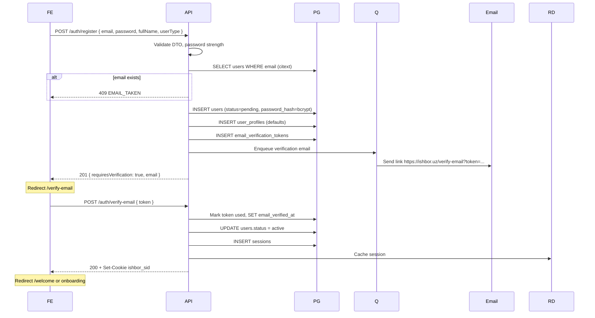
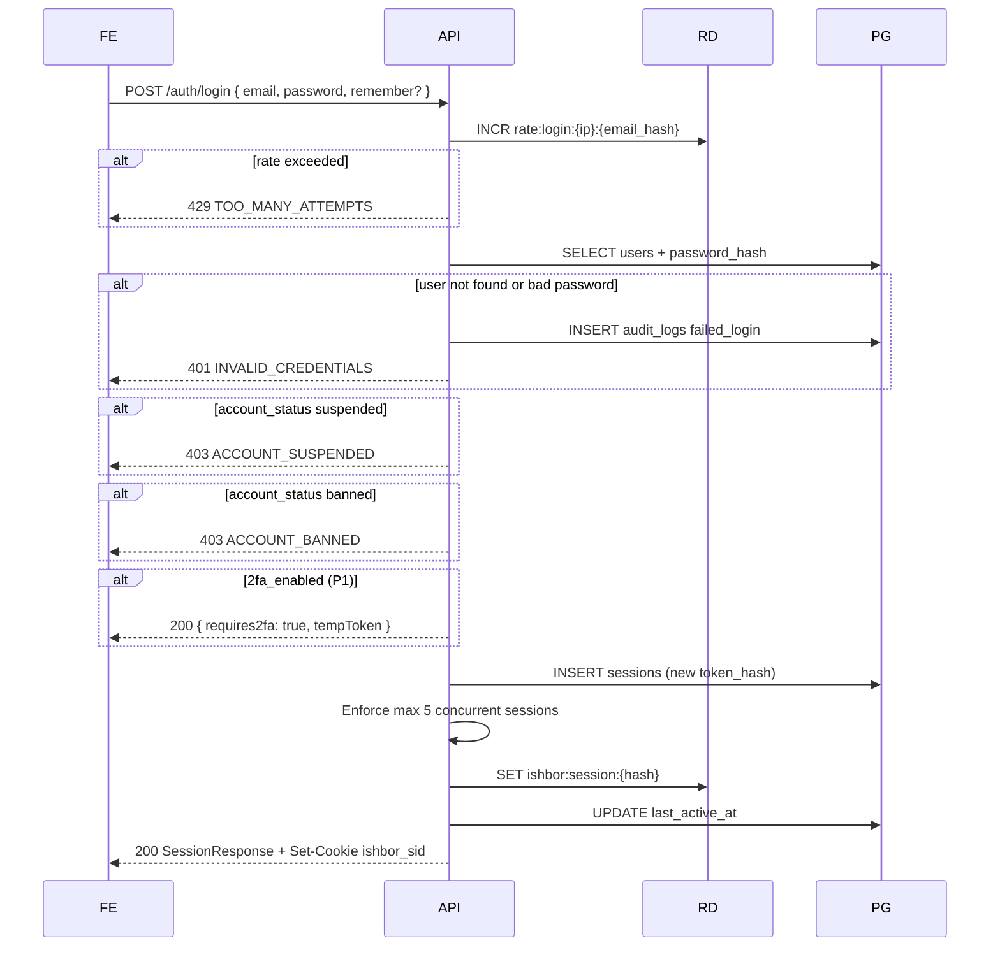
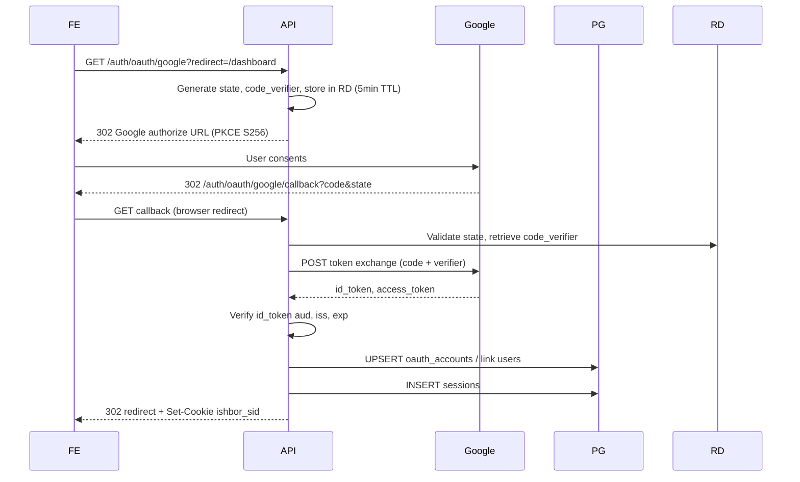
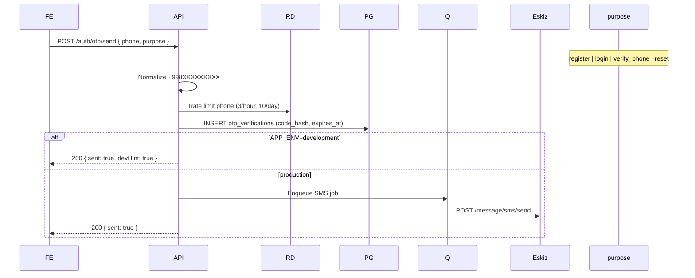
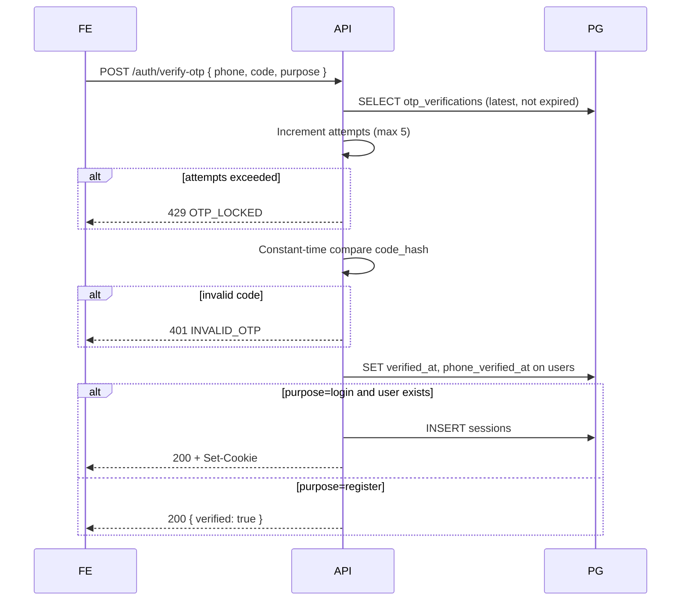
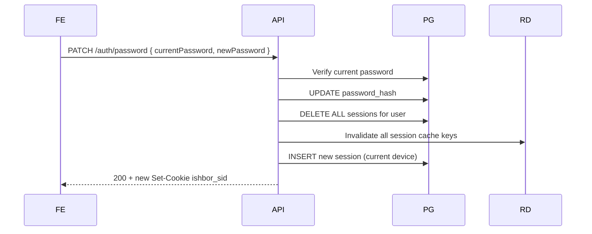
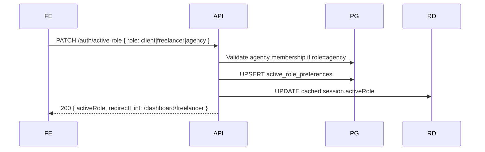

# AUTH_FLOW.md

**Scope:** End-to-end authentication sequences for Ishbor Marketplace  
**Stack:** FastAPI, PostgreSQL `sessions`, Redis cache, Eskiz SMS  
**Audience:** Backend implementers, frontend integrators, QA

---

## 1. Conventions

| Symbol | Meaning |
|--------|---------|
| FE | TanStack Start web client (`ishbor.uz`) |
| API | FastAPI auth service (`api.ishbor.uz/v1`) |
| PG | PostgreSQL |
| RD | Redis |
| Q | BullMQ job queue |

All successful auth flows end with `Set-Cookie: ishbor_sid=...` unless `requiresVerification` or `requires2fa` intermediate state applies.

---

## 2. Registration (email + password)



**Business rules:**
- `userType` is permanent: `client` or `freelancer`
- Referral code validated synchronously; invalid code ignored (no error)
- Onboarding draft from guest session merged into `user_profiles` if present
- `UserRegistered` domain event emitted after email verified (not at INSERT)

**Frontend routes:** `/register` → `/verify-email` → `/welcome` → onboarding steps

---

## 3. Login (email + password)



**Remember me:** `remember=true` → session TTL 30 days; cookie Max-Age matches.

**Demo accounts:** When `ALLOW_DEMO_AUTH=true`, seeded passwords accepted — same flow, flagged in audit log.

---

## 4. Logout

```mermaid
sequenceDiagram
    participant FE
    participant API
    participant PG
    participant RD

    FE->>API: POST /auth/logout (Cookie: ishbor_sid)
    API->>RD: GET session cache
    API->>PG: DELETE sessions WHERE token_hash
    API->>RD: DEL ishbor:session:{hash}
    API-->>FE: 204 + Set-Cookie ishbor_sid=; Max-Age=0
    Note over FE: Clear client UI state, redirect /
```

**Logout all devices:** `POST /auth/logout-all` — deletes all `sessions` for user_id, clears Redis keys by pattern.

---

## 5. Google OAuth 2.0 (PKCE)

See [OAUTH_ARCHITECTURE.md](./OAUTH_ARCHITECTURE.md) for endpoint detail. Summary sequence:



**Account linking:** If Google email matches existing verified user → link `oauth_accounts`. If email unverified → require email verification before link.

**Replaces:** Hardcoded `nargiza@ishbor.uz` GoogleButton bypass.

---

## 6. Phone OTP (Eskiz SMS — Uzbekistan)

### 6.1 Send OTP



### 6.2 Verify OTP



**Dev code:** `123456` accepted only when `APP_ENV=development` — CI must assert this flag is false in production deploy config.

**Production SMS copy (Uzbek):** `Ishbor tasdiqlash kodi: {code}. 10 daqiqa amal qiladi.`

---

## 7. Session refresh (implicit)

Ishbor web auth does not use refresh tokens. Session validity is extended on activity:

| Event | Action |
|-------|--------|
| Authenticated API call | Sliding window: if `< 50%` TTL remaining, extend `expires_at` in PG + Redis |
| Active role switch | Session context updated in Redis; no new cookie unless rotation policy triggers |
| Privilege elevation (admin grant) | Force rotation — new `ishbor_sid` |

See [SESSION_MANAGEMENT.md](./SESSION_MANAGEMENT.md).

---

## 8. Password change (authenticated)



All other devices receive 401 on next request.

---

## 9. Active role switch



**Agency gate:** No active `agency_members` row → 403 `AGENCY_MEMBERSHIP_REQUIRED`.

---

## 10. Error response envelope

All auth errors follow API standard:

| Field | Example |
|-------|---------|
| `code` | `INVALID_CREDENTIALS` |
| `message` | Uzbek user-facing text |
| `details` | Optional field-level validation |

HTTP status maps: 400 validation, 401 auth, 403 forbidden status/role, 409 conflict, 429 rate limit.

---

## 11. Frontend integration checklist

- [ ] Remove all reads/writes to `ishbor-session` localStorage
- [ ] `credentials: 'include'` on all API fetch calls to `api.ishbor.uz`
- [ ] Login/register forms POST directly or via BFF — never store password in state after submit
- [ ] OAuth redirect URIs whitelisted in Google Console for `ishbor.uz` and staging
- [ ] OTP input masks +998; validate 9 digits after country code
- [ ] Handle `requiresVerification` and `requires2fa` without treating as errors

---

## 12. Related documents

- [AUTH_ARCHITECTURE.md](./AUTH_ARCHITECTURE.md) — overview
- [OAUTH_ARCHITECTURE.md](./OAUTH_ARCHITECTURE.md) — Google PKCE detail
- [EMAIL_VERIFICATION_FLOW.md](./EMAIL_VERIFICATION_FLOW.md)
- [PASSWORD_RESET_FLOW.md](./PASSWORD_RESET_FLOW.md)
- [COOKIE_STRATEGY.md](./COOKIE_STRATEGY.md)

---

*Sequences align with API_SPECIFICATION.md §2 and MESSAGES/NOTIFICATIONS domain triggers post-auth.*
