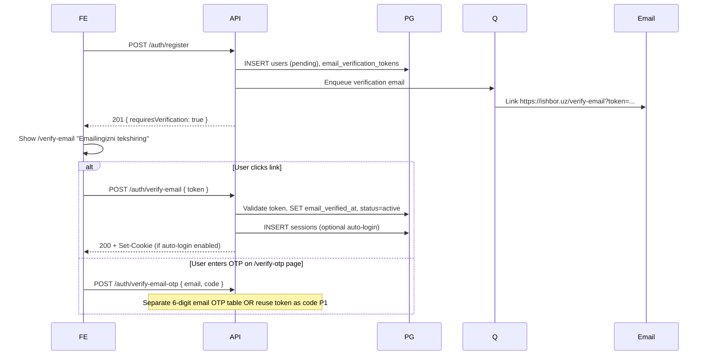
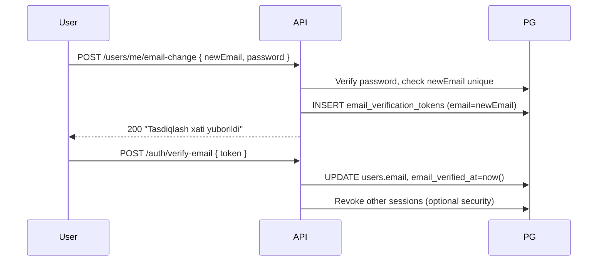

# EMAIL_VERIFICATION_FLOW.md

**Scope:** Email address verification for Ishbor Marketplace  
**Stack:** FastAPI, PostgreSQL `email_verification_tokens`, BullMQ email, optional phone OTP fallback  
**Related OTP:** Phone verification uses Eskiz SMS — see AUTH_FLOW.md; dev code `123456` only in development

---

## 1. When verification is required

| Scenario | Email verified required? |
|----------|-------------------------|
| Email/password registration | yes — before full account active |
| Google OAuth (email_verified=true from Google) | auto-verified at creation |
| Google OAuth (email_verified=false) | yes — send verification email |
| Email change in settings | yes — verify new address before swap |
| Password reset | no — uses separate reset token |
| Phone OTP registration (P1) | email optional initially |

Unverified users: `users.account_status = pending` — may login with limited access (browse only) OR blocked from hire/post — product decision: **blocked from POST /projects, POST /services, checkout** until verified.

---

## 2. Token table

Table: `email_verification_tokens` (distinct from `password_reset_tokens`)

| Column | Purpose |
|--------|---------|
| `id` | UUID |
| `user_id` | FK users |
| `email` | Target email (supports change-email flow) |
| `token_hash` | SHA-256 of opaque token |
| `expires_at` | now + 24 hours |
| `used_at` | Single use timestamp |
| `created_at` | |

| Policy | Value |
|--------|-------|
| Token in link | 32-byte random base64url |
| Expiry | 24 hours |
| Resend cooldown | 60 seconds per user |
| Max pending tokens | 2 — invalidate oldest |

---

## 3. Registration verification flow

**Auto-login after verify:** Recommended UX — user lands on `/welcome` authenticated.

---

## 4. Verify email endpoint

**`POST /auth/verify-email`**

Request: `{ token: string }`

| Step | Action |
|------|--------|
| 1 | Hash token, lookup row WHERE used_at IS NULL AND expires_at > now |
| 2 | UPDATE users SET email_verified_at = now(), account_status = active |
| 3 | SET token used_at |
| 4 | Emit `EmailVerified` domain event |
| 5 | Optional: create session + Set-Cookie |
| 6 | Invalidate other pending tokens for same user |

Errors: `400 VERIFICATION_TOKEN_INVALID` — generic message for expired/used/missing.

---

## 5. Resend verification

**`POST /auth/resend-verification`**

| Auth | Body |
|------|------|
| Optional session OR `{ email }` if unauthenticated pending user | — |

Rate limits:
- 1 resend per 60 seconds per user
- 5 resends per email per 24 hours
- 10 resends per IP per hour

Always return 200 with same message when rate limited (do not leak cooldown exact seconds in body — use Retry-After header only).

---

## 6. Phone OTP verification (Eskiz — Uzbekistan)

Parallel channel for users who prefer SMS or fail to receive email.

**`POST /auth/verify-otp`**

Request: `{ phone, code, purpose: "verify_phone" | "register" }`

| Environment | OTP behavior |
|-------------|--------------|
| `APP_ENV=development` | Code `123456` always accepted for test phones |
| `APP_ENV=staging` | Real SMS OR fixed code for QA numbers whitelist |
| `APP_ENV=production` | Real Eskiz SMS only — `123456` rejected |

| Property | Production value |
|----------|------------------|
| Code length | 6 digits |
| TTL | 10 minutes |
| Max attempts | 5 per OTP row |
| Storage | bcrypt or SHA-256 hash of code in `otp_verifications` |
| Phone format | E.164 +998XXXXXXXXX |

After successful phone verify: SET `users.phone_verified_at`. Email may remain unverified — product rule: both required for wallet withdrawal P1.

---

## 7. Email OTP (optional P1)

Six-digit code sent via email as alternative to link clicking:

| Field | Detail |
|-------|--------|
| Table | `otp_verifications` with purpose=`verify_email` |
| Dev code | `123456` in development only |
| UI route | `/verify-otp` shared with phone — field detector by input type |

Production: cryptographically random 6-digit code — never `123456`.

---

## 8. Email change flow

**Settings → Email yangilash**

Old email receives notification of change request — fraud alert.

---

## 9. Email content (Uzbek)

| Template | Subject |
|----------|---------|
| Registration verify | Ishbor — emailingizni tasdiqlang |
| Resend verify | Ishbor — tasdiqlash havolasi |
| Email changed | Ishbor — email o'zgartirish so'rovi |

Link format: `https://ishbor.uz/verify-email?token={token}`

Include plain-text fallback URL for clients blocking HTML.

---

## 10. Frontend routes

| Route | Purpose |
|-------|---------|
| `/verify-email` | Landing after register; resend button; OTP tab P1 |
| `/verify-otp` | Phone or email 6-digit entry |
| Query `?token=` | Auto-submit verify on mount if present |

Gate: Redirect unverified users attempting `/projects/create` to `/verify-email` with return path.

---

## 11. Security

| Control | Detail |
|---------|--------|
| Token hashing | SHA-256 — raw token only in email |
| Single use | used_at enforced |
| Constant-time compare | On OTP code verify |
| No user enumeration on resend | Generic success message |
| Dev OTP gate | CI test asserts `123456` fails when APP_ENV=production |
| Supabase | Not used |

---

## 12. Domain events

| Event | Trigger | Downstream |
|-------|---------|------------|
| `EmailVerified` | Token consumed | Welcome email, referral credit, admin activity WS |
| `PhoneVerified` | OTP success | Trust score update, withdrawal unlock P1 |

---

## 13. Testing checklist

- [ ] Register → email enqueued with valid token
- [ ] Expired token rejected
- [ ] Used token rejected
- [ ] Google verified email skips manual verify
- [ ] Dev OTP 123456 works locally only
- [ ] Production build rejects 123456
- [ ] Resend rate limit enforced
- [ ] Unverified user blocked from POST /projects

---

## 14. Related documents

- [AUTH_FLOW.md](./AUTH_FLOW.md)
- [AUTH_ARCHITECTURE.md](./AUTH_ARCHITECTURE.md)
- [PASSWORD_RESET_FLOW.md](./PASSWORD_RESET_FLOW.md) — separate tokens
- [OAUTH_ARCHITECTURE.md](./OAUTH_ARCHITECTURE.md)

---

*Email link verification primary; phone OTP via Eskiz for +998; dev code 123456 strictly development-only.*
