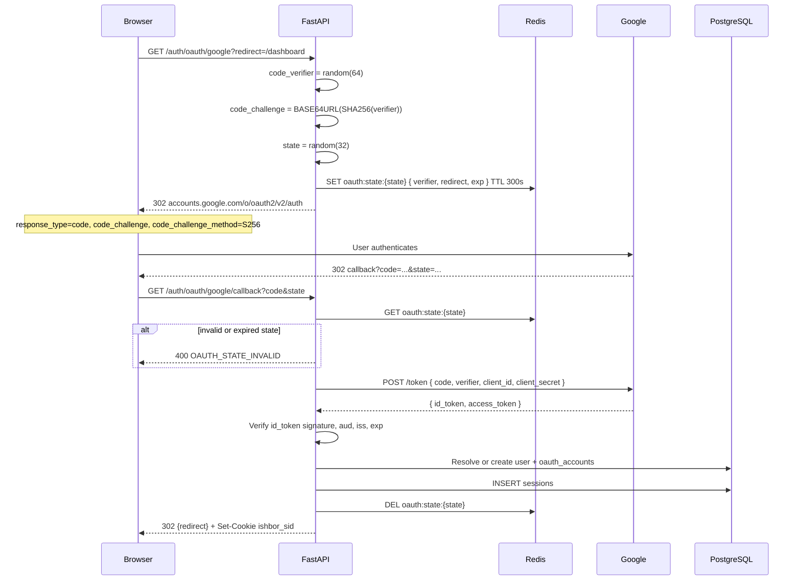

# OAUTH_ARCHITECTURE.md

**Scope:** Google OAuth 2.0 with PKCE for Ishbor Marketplace  
**Stack:** FastAPI auth router, PostgreSQL `oauth_accounts`, Redis OAuth state store  
**Replaces:** `GoogleButton` hardcoded demo login and fake profile assignment

---

## 1. Supported providers (v1)

| Provider | Status | Notes |
|----------|--------|-------|
| Google | P0 — ship | Primary social login for Uzbekistan market |
| Apple | P2 | iOS native — deferred |
| Telegram | P3 | Optional — not planned v1 |

This document covers Google only. Apple will follow same PKCE + `oauth_accounts` pattern.

---

## 2. Environment configuration

| Variable | Example | Purpose |
|----------|---------|---------|
| `OAUTH_GOOGLE_CLIENT_ID` | `*.apps.googleusercontent.com` | Web client ID |
| `OAUTH_GOOGLE_CLIENT_SECRET` | secret | Server-side token exchange |
| `OAUTH_GOOGLE_CALLBACK_URL` | `https://api.ishbor.uz/v1/auth/oauth/google/callback` | Registered redirect URI |
| `OAUTH_GOOGLE_ALLOWED_HD` | empty | No workspace restriction v1 |

Google Cloud Console: OAuth consent screen in Uzbek + Russian; scopes minimal.

---

## 3. OAuth scopes

| Scope | Required | Reason |
|-------|----------|--------|
| `openid` | yes | ID token |
| `email` | yes | Account identity |
| `profile` | yes | fullName, avatar |

No Gmail, Drive, or calendar scopes — Ishbor is identity-only.

---

## 4. PKCE flow overview

Authorization Code flow with PKCE (S256) — mandatory for Ishbor SPA redirect pattern.

---

## 5. FastAPI endpoints

| Method | Path | Description |
|--------|------|-------------|
| GET | `/auth/oauth/google` | Initiate flow — query: `redirect` (relative path only) |
| GET | `/auth/oauth/google/callback` | Google redirect target — exchanges code |
| POST | `/auth/oauth/google/link` | Authenticated — link Google to existing account |
| DELETE | `/auth/oauth/google/unlink` | Authenticated — remove link if password exists |

**Redirect validation:** `redirect` param must start with `/` and must not contain `//` (open redirect prevention). Default: `/dashboard` or role-appropriate dashboard.

---

## 6. Account resolution rules

After Google ID token validated, extract: `sub`, `email`, `email_verified`, `name`, `picture`.

| Condition | Action |
|-----------|--------|
| `oauth_accounts` exists for provider+sub | Login existing user |
| Email matches verified `users.email` | Link new oauth_account to user |
| Email matches unverified user | Require email verification before link |
| No user exists | CREATE users (OAuth-only, no password_hash), profiles, oauth_accounts |
| Email exists, different Google sub | 409 `OAUTH_EMAIL_CONFLICT` — prompt login with password first |

**Profile sync:** Update avatar URL and display name from Google on each login if user has not customized (settings flag `profile_locked`).

---

## 7. PostgreSQL `oauth_accounts`

| Column | Notes |
|--------|-------|
| `provider` | `google` |
| `provider_user_id` | Google `sub` |
| `user_id` | FK users |
| `email_at_provider` | Snapshot for support |
| `access_token_enc` | AES-256 encrypted — optional, for future Google API |
| `refresh_token_enc` | Encrypted — only if offline access requested (not v1) |
| `created_at` | |

UNIQUE `(provider, provider_user_id)` and UNIQUE `(user_id, provider)`.

---

## 8. Redis OAuth state

| Key | Value | TTL |
|-----|-------|-----|
| `ishbor:oauth:state:{state}` | JSON: `{ code_verifier, redirect, ip, created_at }` | 300 seconds |

Single use — deleted on successful callback or expiry.

Rate limit: 10 OAuth initiations per IP per hour.

---

## 9. Security controls

| Control | Detail |
|---------|--------|
| PKCE S256 | Prevents authorization code interception |
| State parameter | CSRF protection on OAuth return |
| ID token validation | Verify signature via Google JWKS, check `aud`, `iss`, `exp` |
| Nonce | Optional v1 — add for OpenID hardening P1 |
| HTTPS only | Callback URL must be HTTPS in production |
| No token in URL | Session via Set-Cookie only — never append token to redirect |
| Account enumeration | OAuth errors use generic Uzbek message |

---

## 10. Error handling (user-facing)

| Error code | HTTP | User message (UZ) |
|------------|------|-------------------|
| `OAUTH_STATE_INVALID` | 400 | Kirish jarayoni tugadi. Qaytadan urinib ko'ring. |
| `OAUTH_EMAIL_CONFLICT` | 409 | Bu email boshqa usul bilan ro'yxatdan o'tgan. |
| `OAUTH_PROVIDER_ERROR` | 502 | Google bilan bog'lanishda xatolik. |
| `OAUTH_ACCOUNT_SUSPENDED` | 403 | Hisobingiz bloklangan. |

Redirect errors to `/login?error=oauth_failed` with code in query for FE display — no sensitive details.

---

## 11. Frontend integration

| Component | Behavior |
|-----------|----------|
| GoogleButton | `window.location.href = '/api/v1/auth/oauth/google?redirect=' + encodeURIComponent(returnPath)` |
| Login page | Show Google as primary alternative to email |
| Register page | Same — OAuth creates account |
| Settings → Security | Show linked Google account; unlink if password set |

No Google SDK required on web — full server-side redirect flow.

---

## 12. Mobile OAuth (future)

Native Google Sign-In returns authorization code to app → `POST /auth/mobile/oauth/google` with PKCE verifier — same `oauth_accounts` resolution.

Do not share web client secret with mobile — use separate Google OAuth client IDs per platform.

---

## 13. Testing checklist

- [ ] PKCE: callback fails without valid verifier in Redis
- [ ] State reuse rejected
- [ ] Open redirect blocked (`redirect=https://evil.com`)
- [ ] New user creation sets `email_verified_at` when Google email_verified=true
- [ ] Returning user gets session cookie only
- [ ] Link flow requires authenticated cookie session
- [ ] Unlink blocked if no password_hash on user

---

## 14. Related documents

- [AUTH_FLOW.md](./AUTH_FLOW.md) — sequence summary
- [AUTH_ARCHITECTURE.md](./AUTH_ARCHITECTURE.md)
- [COOKIE_STRATEGY.md](./COOKIE_STRATEGY.md)
- [EMAIL_VERIFICATION_FLOW.md](./EMAIL_VERIFICATION_FLOW.md) — conflict cases
- [JWT_STRATEGY.md](./JWT_STRATEGY.md) — mobile token issuance

---

*Google OAuth 2.0 PKCE via FastAPI — no Supabase Auth, no client-side Google token handling.*
