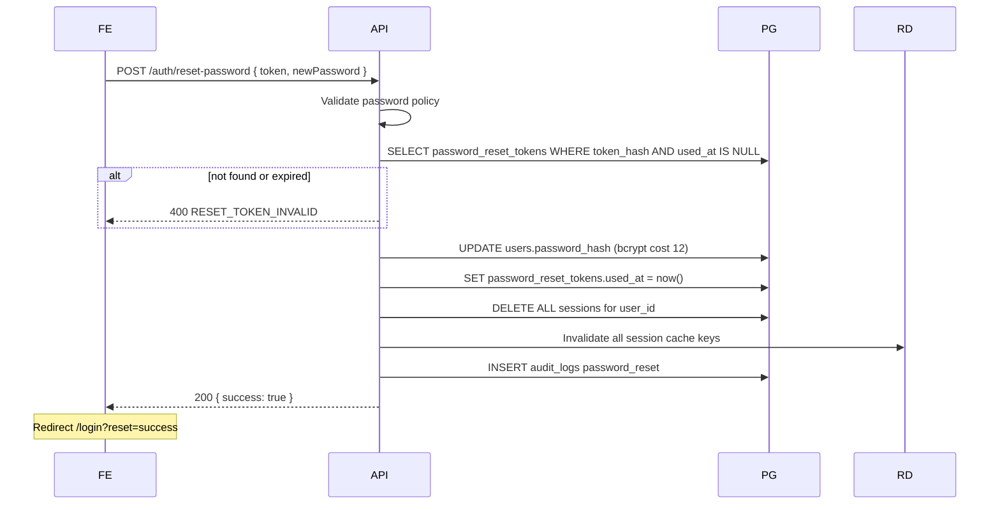

# PASSWORD_RESET_FLOW.md

**Scope:** Forgot-password and reset-password for Ishbor Marketplace  
**Stack:** FastAPI, PostgreSQL `password_reset_tokens`, BullMQ email worker, Redis rate limits  
**Replaces:** `forgot-password.tsx` setTimeout simulation

---

## 1. User journey

| Step | Route | Action |
|------|-------|--------|
| 1 | `/forgot-password` | User enters email |
| 2 | Email inbox | Clicks reset link |
| 3 | `/reset-password?token=...` | Enters new password |
| 4 | `/login` | Logs in with new password |

All copy in Uzbek. Link domain: `https://ishbor.uz/reset-password?token={opaque}`

---

## 2. Forgot password endpoint

**`POST /auth/forgot-password`**

Request body: `{ email: string }`

| Step | Server action |
|------|---------------|
| 1 | Validate email format |
| 2 | Redis rate limit: 3 requests / email / hour, 10 / IP / hour |
| 3 | SELECT users WHERE email (citext) — timing-safe path |
| 4 | If user exists AND has password_hash: INSERT password_reset_tokens |
| 5 | Enqueue email job with reset link |
| 6 | Always return `200 { message: "Agar email ro'yxatdan o'tgan bo'lsa, xabar yuborildi" }` |

**No email enumeration:** Response identical whether email exists. Response time normalized ±50ms jitter.

OAuth-only users (no password): silently skip token creation — same 200 response.

---

## 3. Reset token design

Table: `password_reset_tokens`

| Column | Value |
|--------|-------|
| `id` | UUID PK |
| `user_id` | FK users |
| `token_hash` | SHA-256 of opaque token |
| `expires_at` | now + 1 hour |
| `used_at` | NULL until consumed |
| `created_at` | Audit |

| Property | Policy |
|----------|--------|
| Token format | 32-byte random → base64url in email link |
| Storage | Hash only — raw token never persisted |
| Single use | SET used_at on success; replay rejected |
| Active tokens per user | Max 3 — oldest invalidated on 4th request |
| Expiry | 1 hour — no extension |

---

## 4. Reset password endpoint

**`POST /auth/reset-password`**

Request body: `{ token: string, newPassword: string }`

**No auto-login after reset** — user must authenticate explicitly (prevents email link hijack session).

---

## 5. Email template

| Field | Content |
|-------|---------|
| Subject | Ishbor — parolni tiklash |
| From | `noreply@ishbor.uz` |
| Body | Uzbek instructions + button link |
| Link TTL note | "1 soat ichida amal qiladi" |
| Ignore note | "Agar so'ramagan bo'lsangiz, e'tiborsiz qoldiring" |

Provider: Resend/SMTP via BullMQ — async, non-blocking on API response.

---

## 6. Rate limits (Redis)

| Key pattern | Limit | Window |
|-------------|-------|--------|
| `rl:forgot:email:{hash}` | 3 | 1 hour |
| `rl:forgot:ip:{ip}` | 10 | 1 hour |
| `rl:reset:ip:{ip}` | 5 | 1 hour |
| `rl:reset:token_fail:{ip}` | 10 | 15 min |

Exceeded → `429 TOO_MANY_REQUESTS` with Retry-After header.

---

## 7. Authenticated password change

Distinct from reset flow — **`PATCH /auth/password`** (requires current password):

| Difference | Reset flow | Change flow |
|------------|------------|-------------|
| Auth | Token in email | Active session |
| Current password | Not required | Required |
| Session after | None — login required | New session for current device |
| Token table | password_reset_tokens | N/A |

Both flows revoke all other sessions — see [SESSION_MANAGEMENT.md](./SESSION_MANAGEMENT.md).

---

## 8. Phone-based reset (P1 alternative)

When user has verified phone but no email access:

| Step | Endpoint |
|------|----------|
| Request OTP | `POST /auth/otp/send { phone, purpose: reset }` |
| Verify + set password | `POST /auth/reset-password-phone { phone, code, newPassword }` |

Same session revocation rules. Eskiz SMS — see AUTH_FLOW.md.

---

## 9. Security controls

| Threat | Mitigation |
|--------|------------|
| Email enumeration | Uniform 200 response |
| Token brute force | Hash lookup + IP rate limit |
| Token leakage in logs | Never log raw token |
| Replay | Single-use + short TTL |
| Session fixation post-reset | No cookie on reset response |
| Weak password | Min 8, max 128; optional HIBP check |
| Account takeover via reset | Optional notify email "parol o'zgartirildi" on success |

---

## 10. Audit and monitoring

| Event | Logged |
|-------|--------|
| `password_reset_requested` | user_id if found, IP, email hash |
| `password_reset_completed` | user_id, IP |
| `password_reset_failed` | reason code, IP |
| `password_changed` | user_id, session_id |

Alert: >100 forgot-password requests / hour globally → possible abuse.

---

## 11. Frontend requirements

| Page | Requirement |
|------|-------------|
| `/forgot-password` | Submit email; show success message regardless |
| `/reset-password` | Read token from query; validate client-side non-empty |
| Token missing | Redirect forgot-password with error |
| Success | Link to login with confirmation banner |
| Expired token | Message + link to request new |

Remove all `setTimeout` mock delays from current implementation.

---

## 12. Error codes

| Code | HTTP | Meaning |
|------|------|---------|
| `RESET_TOKEN_INVALID` | 400 | Missing, expired, or used token |
| `PASSWORD_TOO_WEAK` | 400 | Policy violation |
| `TOO_MANY_REQUESTS` | 429 | Rate limited |
| `OAUTH_ONLY_ACCOUNT` | 400 | Use Google login — optional explicit error on reset form |

---

## 13. Related documents

- [AUTH_FLOW.md](./AUTH_FLOW.md)
- [SESSION_MANAGEMENT.md](./SESSION_MANAGEMENT.md)
- [EMAIL_VERIFICATION_FLOW.md](./EMAIL_VERIFICATION_FLOW.md) — separate token table
- [SECURITY_ARCHITECTURE.md](../SECURITY_ARCHITECTURE.md)

---

*Production password reset via email link and `password_reset_tokens` — no client-side simulation.*
