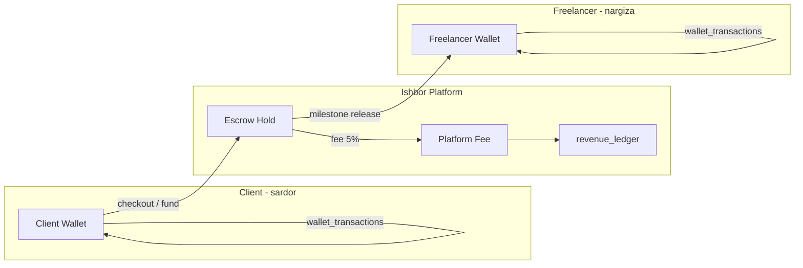
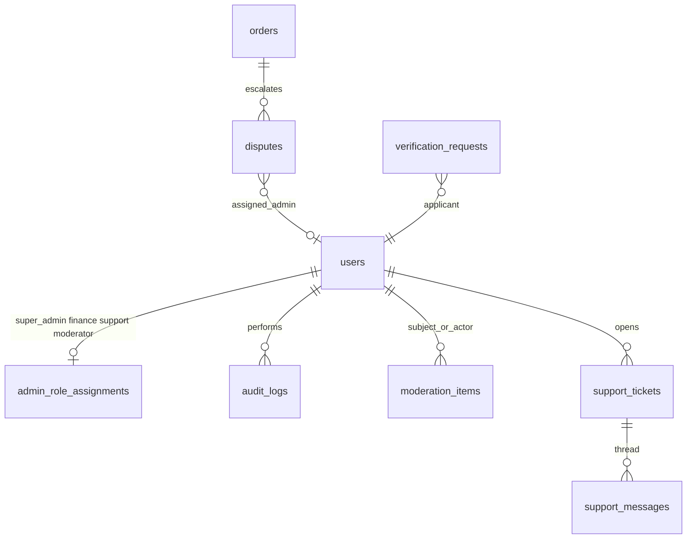

# ERD.md — Ishbor Marketplace Entity Relationship Diagram

**Engine:** PostgreSQL 16 on VPS  
**Source:** [DATABASE_SCHEMA.md](../DATABASE_SCHEMA.md), `server/db/schema.ts`  
**Notation:** PK = primary key, FK = foreign key, UK = unique

---

## 1. Overview

The Ishbor data model centers on `users` with three major subgraphs:

1. **Identity & profiles** — auth, onboarding, freelancer/client public pages
2. **Marketplace & commerce** — projects, services, orders, escrow, wallet
3. **Communication & ops** — messages, notifications, agencies, admin

---

## 2. Core ERD (Mermaid)

```mermaid
erDiagram
    users ||--o| user_profiles : has
    users ||--o| client_profiles : "client only"
    users ||--o| freelancer_stats : "freelancer metrics"
    users ||--o| wallets : owns
    users ||--o| active_role_preferences : prefers
    users ||--o{ sessions : has
    users ||--o{ oauth_accounts : links
    users ||--o{ payment_methods : stores

    wallets ||--o{ wallet_transactions : ledger

    users ||--o{ projects : "client publishes"
    projects ||--o{ project_attachments : has
    projects ||--o{ applications : receives
    project_attachments }o--|| files : references

    users ||--o{ services : "freelancer sells"
    services ||--o{ service_packages : tiers
    services ||--o{ service_gallery : images
    services ||--o{ service_faqs : faqs

    users ||--o{ portfolios : showcases
    portfolios ||--o{ portfolio_gallery : images
    portfolios ||--o{ portfolio_metrics : stats

    applications }o--|| projects : for
    applications }o--|| users : "freelancer applies"
    applications |o--o| orders : "accepted → order"

    users ||--o{ orders : "client side"
    users ||--o{ orders : "freelancer side"
    orders ||--o{ order_milestones : milestones
    orders ||--|| escrow_workflows : protected_by
    orders ||--o{ reviews : feedback
    orders |o--o| services : "optional source"
    orders |o--o| projects : "optional source"

    escrow_workflows ||--o{ escrow_milestones : funding
    escrow_workflows ||--o{ escrow_timeline_events : audit_trail
    escrow_workflows ||--o{ disputes : may_have

    users ||--o{ agencies : owns
    agencies ||--o{ agency_members : team
    agencies ||--o{ agency_case_studies : portfolio
    agencies ||--o{ agency_invites : pending
    agency_members }o--|| users : member

    conversations ||--o{ conversation_participants : includes
    conversation_participants }o--|| users : participant
    conversations ||--o{ messages : contains
    messages }o--|| users : sender
    messages |o--o| files : attachment

    users ||--o{ notifications : receives
    users ||--o| notification_preferences : configures

    users ||--o| admin_role_assignments : "admin only"
    users ||--o{ audit_logs : "actor"

    users ||--o{ saved_items : bookmarks
    users ||--o{ verification_requests : kyc

    users {
        uuid id PK
        citext email UK
        varchar full_name
        enum user_type
        varchar username UK
        varchar company_slug UK
        enum account_status
        boolean verified
        timestamptz created_at
    }

    wallets {
        uuid user_id PK_FK
        numeric available
        numeric escrow_held
        numeric pending
        numeric lifetime_earned
        char currency
    }

    wallet_transactions {
        uuid id PK
        uuid user_id FK
        enum kind
        enum category
        numeric amount
        numeric running_balance
        uuid related_order_id
        varchar idempotency_key UK
        timestamptz created_at
    }

    orders {
        uuid id PK
        varchar title
        uuid client_user_id FK
        uuid freelancer_user_id FK
        uuid service_id FK
        uuid project_id FK
        enum status
        numeric amount
        boolean escrow_funded
        timestamptz created_at
    }

    escrow_workflows {
        uuid id PK
        uuid order_id FK_UK
        numeric amount
        enum status
        boolean frozen_by_admin
    }

    projects {
        uuid id PK
        varchar slug UK
        uuid owner_user_id FK
        varchar title
        enum status
        enum admin_status
        boolean escrow_protected
    }

    services {
        uuid id PK
        varchar slug UK
        uuid owner_user_id FK
        numeric base_price
        enum status
    }

    conversations {
        uuid id PK
        varchar project_context
        timestamptz updated_at
    }

    messages {
        uuid id PK
        uuid conversation_id FK
        uuid sender_user_id FK
        enum type
        text body
        timestamptz created_at
    }

    agencies {
        uuid id PK
        varchar slug UK
        uuid owner_user_id FK
        varchar name
        enum verification_level
        enum status
    }

    agency_members {
        uuid id PK
        uuid agency_id FK
        uuid user_id FK
        enum role
        enum status
    }

    audit_logs {
        uuid id PK
        uuid actor_user_id FK
        enum category
        text action
        jsonb metadata
        timestamptz created_at
    }
```

---

## 3. Demo user relationships

Fixed UUIDs for seed data (legacy frontend IDs in comments):

| Legacy ID | UUID | Email | Role |
|-----------|------|-------|------|
| `u-client-1` | `11111111-1111-4111-8111-000000000001` | sardor@asaka.uz | client |
| `u-freelancer-1` | `22222222-2222-4222-8222-000000000002` | nargiza@ishbor.uz | freelancer |

**Example relationship chain (order o1 from mock-data):**

```
sardor (client) ──owns──► project "Fintech App Redesign"
         │
         ├──creates──► order o1 ($12,000, in_progress)
         │                  │
         │                  ├──freelancer──► nargiza
         │                  ├──escrow_workflows (funded)
         │                  └──order_milestones (2/3 done)
         │
         └──conversation m1 ──messages──► nargiza
```

---

## 4. Cardinality rules

| Rule | Enforcement |
|------|-------------|
| One wallet per user | `wallets.user_id` PK |
| One escrow per order | `escrow_workflows.order_id` UNIQUE |
| One proposal per freelancer per project | `UNIQUE(project_id, freelancer_user_id)` on `applications` |
| One review per reviewer per order | `UNIQUE(order_id, reviewer_user_id)` on `reviews` |
| One agency membership row per user per agency | `UNIQUE(agency_id, user_id)` on `agency_members` |
| Wallet balance never negative | `CHECK (available >= 0)` on `wallets` |

---

## 5. Money flow (logical)



Ledger tables: `wallet_transactions` (per-user), `payment_records` (gateway audit), `revenue_ledger` (platform).

---

## 6. Admin subgraph



Admin tables are never exposed to non-admin FastAPI routes. `admin_role_assignments.admin_role` maps to `canAccessSection()` in RBAC.

---

## 7. Supporting entities (not in main diagram)

| Table | Relationship |
|-------|--------------|
| `subscriptions` | 1:1 with `users` — plan limits |
| `credits_wallets` | 1:1 — featured listings, AI credits |
| `referrals` | 1:1 — growth program |
| `featured_listings` | N:1 user — promoted entity |
| `analytics_events` | N:1 user — append-only, partitioned |
| `ai_usage_logs` | N:1 user — quota tracking |
| `files` | N:1 owner — S3 metadata |
| `search_documents` | Denormalized search index |

---

## 8. Public read views

FastAPI public endpoints query views, not raw tables:

| View | Exposes |
|------|---------|
| `v_public_freelancers` | Published freelancers with `freelancer_stats` |
| `v_public_services` | `status=published`, `admin_status=approved` |
| `v_public_projects` | Published projects, non-suspended owner |
| `v_public_agencies` | Published agencies |
| `v_public_portfolios` | Published portfolios |

Views filter out `account_status != 'active'` and suspended admin statuses.

---

*See [TABLE_SPECIFICATIONS.md](./TABLE_SPECIFICATIONS.md) for full column lists.*
