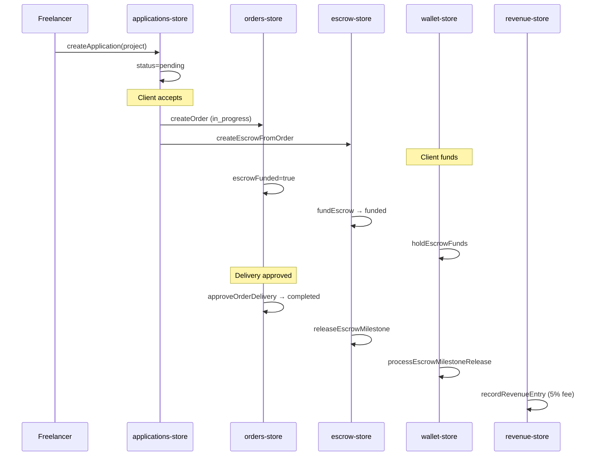

# DATA_FLOW_MAP.md — Persistence & Sync Paths

---

## 1. Current data planes

| Plane | Technology | Scope | Authority |
|-------|------------|-------|-----------|
| **A — Server DB** | PostgreSQL + Drizzle | users, sessions, user_profiles, active_role_preferences | **Authoritative** (when DATABASE_URL set) |
| **B — HttpOnly cookie** | `ishbor_sid` | Session token | **Authoritative** for auth |
| **C — localStorage** | 31+ keys | All marketplace/commerce data | **De facto authority** (demo) |
| **D — sessionStorage** | onboarding, pending password | Registration flow | Ephemeral |
| **E — mock-data.ts** | Static seed arrays | freelancers, services, projects baseline | Read-only seed |
| **F — In-memory** | Computed stores | ranking, CRM, AI matching | Derived |

---

## 2. Read path (typical page load)

```
Browser request
  → auth-bootstrap.js checks localStorage (protected routes)
  → SSR: guards skip (window undefined) — known gap
  → React hydrate
  → hydrateAuthFromServer() → getServerSession → applyServerSession → localStorage sync
  → Route component mounts
  → Store read: localStorage JSON parse + merge mock-data
  → useSyncExternalStore snapshot → render
```

---

## 3. Write path (typical user action)

```
User action (e.g. acceptApplication)
  → store function mutates in-memory cache
  → localStorage.setItem(STORAGE_KEY)
  → notify() → useSyncExternalStore re-render
  → Side effects: other stores called synchronously (createOrder, createEscrow)
  → notifications-store.addNotification
  → analytics-events-store.recordAnalyticsEvent
  → NO server persistence (except auth)
```

---

## 4. Auth data flow (implemented)

```
POST loginSession
  → verifyCredentials (DB | dev registry | SERVER_DEMO_USERS)
  → createServerSession (DB sessions | memorySessions Map)
  → Set-Cookie: ishbor_sid
  → Response { session: AuthSession }
  → applyServerSession → localStorage ishbor-session

GET getServerSession
  → read cookie → readServerSession
  → return user DTO

POST logoutSession
  → destroyServerSession (DB delete | memory delete)
  → Clear-Cookie
  → client clearLocalSession
```

---

## 5. Admin → marketplace sync flow

```
Admin UI action (suspend user / reject project)
  → admin-data-store.updateAdminUser / updateAdminProject
  → persist ishbor-admin-data
  → syncAccountStatusFromAdmin → user-status-store
  → updateProjectStatus / updateServiceStatus → marketplace stores
  → (if suspended user logged in) auth.logout()
```

**Gap:** Admin data and marketplace data are separate localStorage keys — can desync on multi-device.

---

## 6. Commerce data flow (north star)



All steps today: **client localStorage only**.

---

## 7. Target production data flow

Per `11-backend/`:

| Domain | Write API | Read API | Events |
|--------|-----------|----------|--------|
| Projects | POST/PATCH /api/v1/projects | GET + FTS /search | ProjectPublished |
| Orders | POST /api/v1/orders | GET /orders/:id | OrderCreated, OrderCompleted |
| Escrow | POST /escrow/:id/fund | GET /escrow/:id | EscrowFunded, EscrowReleased |
| Wallet | POST /wallet/deposit | GET /wallet | LedgerEntryCreated |
| Messages | POST /conversations/:id/messages | GET + WS | MessageSent |
| Notifications | — (worker) | GET + WS | NotificationCreated |

**Migration flag:** `VITE_API_MODE=local|remote` (`src/lib/api-mode.ts`)

---

## 8. Storage key quick reference

Full registry: [STORE_REGISTRY.md](../02-integration/STORE_REGISTRY.md)

| Key | Entity | Cap |
|-----|--------|-----|
| `ishbor-user-orders` | Order[] | — |
| `ishbor-user-escrow` | EscrowWorkflow[] | — |
| `ishbor-wallet` | Record<userId, UserWallet> | — |
| `ishbor-messages-{userId}` | MessagesState | migrates legacy key |
| `ishbor-notifications` | Record<userId, Notification[]> | corrupt guard |
| `ishbor-analytics-events` | AnalyticsEvent[] | 5000 |
| `ishbor-revenue-log` | RevenueEntry[] | 2000 |
| `ishbor-admin-data` | AdminDataState | full platform snapshot |

---

## 9. Failure & recovery (current)

| Failure | Behavior | Recovery |
|---------|----------|----------|
| localStorage corrupt JSON | Store returns seed/empty | User loses local data |
| localStorage quota exceeded | write throws (uncaught in some stores) | Clear stress seed |
| Session cookie expired | getServerSession null | Redirect login via AuthGate |
| DB unavailable | Falls back to demo/memory sessions | Demo mode continues |
| Multi-tab conflict | storage event on ishbor-session | auth subscribe notify |

**Production requirement:** Server is source of truth — client cache is optimistic UI only with rollback.
